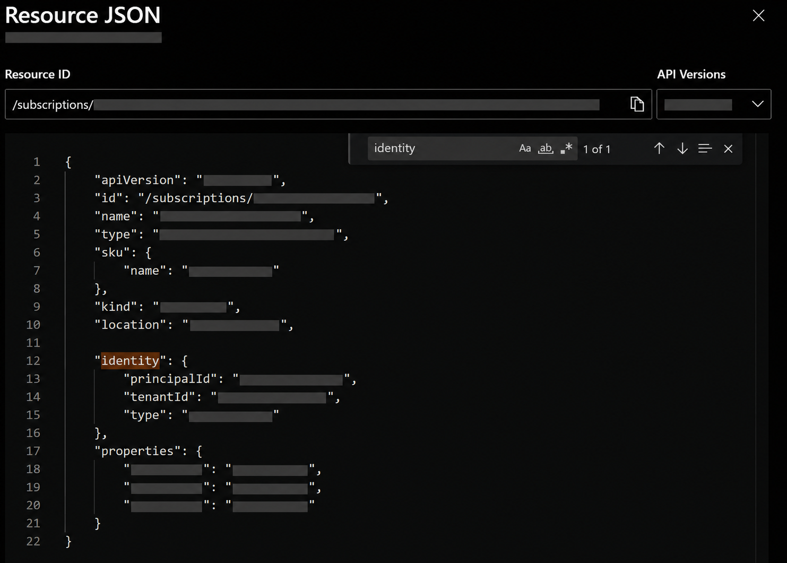
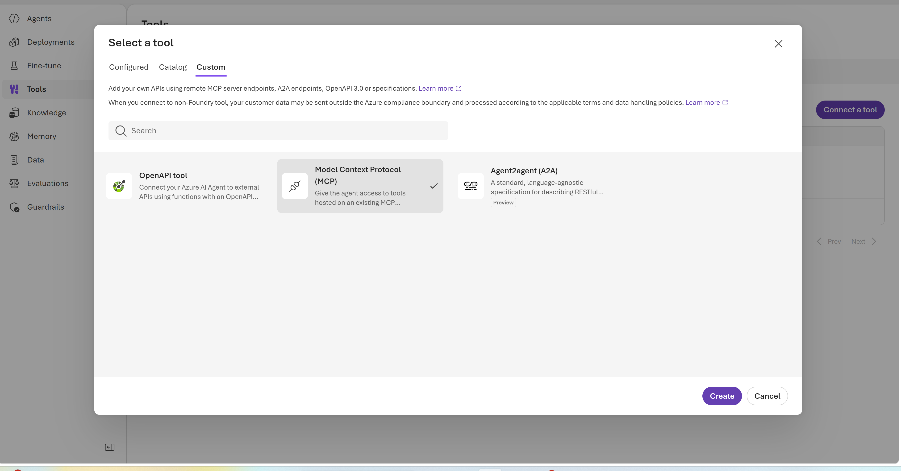
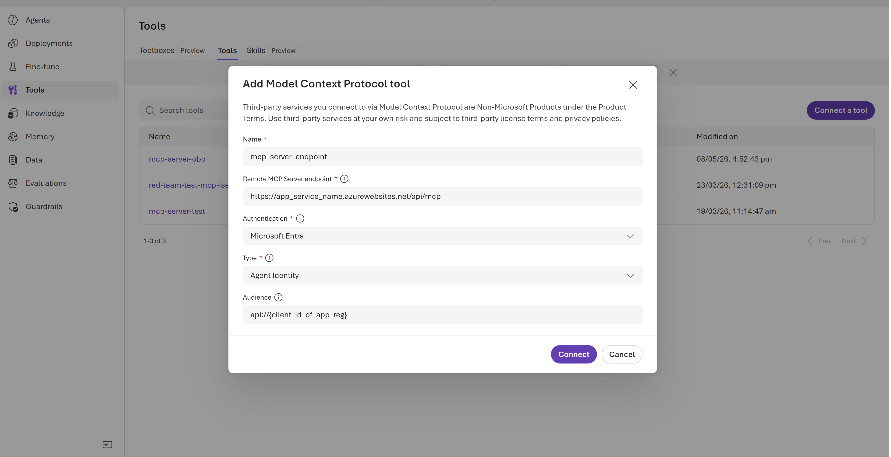
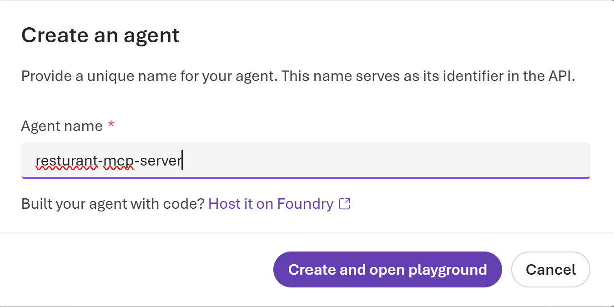

# Securing an MCP Server on Azure App Service with Microsoft Entra Authentication and Enabling Access via Agent Identity Authentication for Autonomous Agents


## Introduction

The Model Context Protocol (MCP) is becoming a common way to connect AI agents to external tools, APIs, and data sources. Once those tools are deployed outside a local development environment, authentication becomes a core part of the design. An MCP endpoint should only be callable by trusted clients, especially when it can expose business data or trigger actions.

In this walkthrough, we secure a FastMCP server running on Azure App Service with Microsoft Entra ID authentication. The server is called by an Azure AI Foundry agent through its agent identity, and the application does not need to validate tokens in Python code. Azure App Service EasyAuth handles that responsibility at the platform layer.


## Scenario

The sample application is a FastAPI restaurant review app deployed to Azure App Service. To keep the authentication pattern easy to follow, the MCP server in this post uses static restaurant data rather than a database. That keeps the focus on identity, access control, and MCP client configuration.

The MCP server exposes four tools:

| Tool | Description |
|------|-------------|
| `list_restaurants_mcp` | Lists restaurants with average rating and review count |
| `get_details_mcp` | Returns restaurant details and sample reviews |
| `recommend_restaurant_mcp` | Recommends a restaurant by cuisine and minimum rating |
| `summarize_restaurant_mcp` | Creates a short agent-friendly restaurant summary |

The goal is to allow a Microsoft Agent Framework agent deployed to Azure AI Foundry to call these tools securely by using its agent identity. Any request without a valid token, a valid audience, and an approved client identity should be rejected.

## Architecture

```text
Azure AI Foundry deployed agent
  |
  | client_credentials flow with MCP.Access app role
  v
Azure App Service with EasyAuth v2 and Return401
  |
  | JWT validated for issuer, audience, and allowed client application
  v
FastAPI and gunicorn with lifespan enabled
  |
  | /api/mcp mounted as FastMCP streamable HTTP
  v
Static restaurant MCP tools
```

EasyAuth is the important boundary in this design. It validates Microsoft Entra tokens before traffic reaches the FastAPI application. The app does not parse the `Authorization` header, inspect claims, or implement its own allowlist.

## Step 1: Add the MCP server to FastAPI

Start by adding `fastmcp` to the app-local dependencies in `src/pyproject.toml`:

```toml
dependencies = [
    "fastapi",
    "uvicorn[standard]",
    "uvicorn-worker",
    "fastmcp",
]
```

Next, create `src/fastapi_app/mcp_server.py`. The tool implementation below uses static sample values. In a production app, you can replace the in-memory lists with database queries or API calls while keeping the same authentication design.

```python
from fastmcp import FastMCP

mcp = FastMCP(name="RestaurantReviewsMCP")

RESTAURANTS = [
    {
        "id": 1,
        "name": "Contoso Curry House",
        "cuisine": "Indian",
        "street_address": "12 Market Street",
        "description": "A casual spot for thali, biryani, and late-night chai.",
        "avg_rating": 4.7,
        "review_count": 128,
    },
    {
        "id": 2,
        "name": "Northwind Noodles",
        "cuisine": "Japanese",
        "street_address": "48 Harbor Road",
        "description": "Small ramen bar known for rich broth and quick service.",
        "avg_rating": 4.5,
        "review_count": 94,
    },
    {
        "id": 3,
        "name": "Fabrikam Fire Grill",
        "cuisine": "Modern Australian",
        "street_address": "7 King Avenue",
        "description": "Open-flame cooking with seasonal local produce.",
        "avg_rating": 4.2,
        "review_count": 61,
    },
]

REVIEWS = {
    1: [
        {"user_name": "Maya", "rating": 5, "review_text": "Great spice balance and fast service."},
        {"user_name": "Liam", "rating": 4, "review_text": "Loved the biryani. The dining room was busy."},
    ],
    2: [
        {"user_name": "Noah", "rating": 5, "review_text": "Excellent broth and perfectly cooked noodles."},
        {"user_name": "Ava", "rating": 4, "review_text": "Compact menu, but everything tasted fresh."},
    ],
    3: [
        {"user_name": "Amelia", "rating": 4, "review_text": "The grill flavors were excellent."},
        {"user_name": "Ethan", "rating": 4, "review_text": "Good option for a team dinner."},
    ],
}


@mcp.tool()
async def list_restaurants_mcp() -> list[dict]:
    """List restaurants with their average rating and review count."""

    return RESTAURANTS


@mcp.tool()
async def get_details_mcp(restaurant_id: int) -> dict | None:
    """Return a restaurant and its sample reviews."""

    restaurant = next(
        (item for item in RESTAURANTS if item["id"] == restaurant_id),
        None,
    )
    if restaurant is None:
        return None

    return {
        "restaurant": restaurant,
        "reviews": REVIEWS.get(restaurant_id, []),
    }


@mcp.tool()
async def recommend_restaurant_mcp(
    cuisine: str | None = None,
    minimum_rating: float = 4.0,
) -> dict:
    """Recommend the highest-rated restaurant that matches the filters."""

    matches = [
        restaurant
        for restaurant in RESTAURANTS
        if restaurant["avg_rating"] >= minimum_rating
        and (cuisine is None or restaurant["cuisine"].lower() == cuisine.lower())
    ]
    if not matches:
        return {
            "recommendation": None,
            "reason": "No restaurant matched the requested filters.",
        }

    recommendation = max(matches, key=lambda item: item["avg_rating"])
    return {
        "recommendation": recommendation,
        "reason": f"Highest-rated match at {recommendation['avg_rating']} stars.",
    }


@mcp.tool()
async def summarize_restaurant_mcp(restaurant_id: int) -> dict | None:
    """Create a short agent-friendly restaurant summary."""

    details = await get_details_mcp(restaurant_id)
    if details is None:
        return None

    restaurant = details["restaurant"]
    summary = (
        f"{restaurant['name']} is a {restaurant['cuisine']} restaurant rated "
        f"{restaurant['avg_rating']} stars across {restaurant['review_count']} reviews. "
        f"It is located at {restaurant['street_address']}."
    )
    return {
        "restaurant_id": restaurant_id,
        "summary": summary,
    }
```

Mount the MCP app in `app.py`. The MCP app owns the MCP path, and FastAPI mounts that app under a prefix.

```python
import uvicorn
from fastapi import FastAPI

from .mcp_server import mcp

MOUNT_PREFIX = "/api"
MCP_PATH = "/mcp"

mcp_app = mcp.http_app(path=MCP_PATH, transport="streamable-http")

app = FastAPI(lifespan=mcp_app.lifespan)


@app.get("/health")
async def health() -> dict:
    return {"status": "healthy", "service": "restaurant-mcp-server"}


app.mount(MOUNT_PREFIX, mcp_app)


if __name__ == "__main__":
    uvicorn.run(app, host="127.0.0.1", port=8001, log_level="info")
```

With this mount shape, the local streamable HTTP endpoint is `http://127.0.0.1:8001/api/mcp`. After deployment, the same endpoint is protected behind the App Service URL.

### Enable lifespan for MCP

The MCP HTTP app exposes its own lifespan handler, so FastAPI must be created with `lifespan=mcp_app.lifespan`. Gunicorn also needs lifespan events enabled. Without both pieces, MCP requests can fail in production because the MCP session manager never starts.


## Step 2: Deploy to Azure App Service

Deploy the app with the Azure Developer CLI:

```bash
azd auth login
azd up
```

Before enabling authentication, confirm that the MCP endpoint works. This verifies the application, MCP mount, and transport before EasyAuth is added to the path.

```bash
curl -X POST https://<your-app>.azurewebsites.net/api/mcp \
  -H "Content-Type: application/json" \
  -H "Accept: application/json, text/event-stream" \
  -d '{"jsonrpc":"2.0","id":1,"method":"initialize","params":{"protocolVersion":"2025-03-26","capabilities":{},"clientInfo":{"name":"test","version":"1.0"}}}'
```

## Step 3: Create the Microsoft Entra app registration

The App Service needs an Entra app registration that represents the protected MCP resource. Create the app registration first:

```bash
az ad app create --display-name "my-mcp-server-auth" \
  --sign-in-audience AzureADMyOrg
```

Capture the generated client ID and object ID. Then set the Application ID URI:

```bash
az ad app update --id <client-id> \
  --identifier-uris "api://<client-id>"
```

Configure the app registration with these access surfaces:

| Configuration | Purpose |
|---------------|---------|
| Application ID URI: `api://<client-id>` | Defines the protected resource audience |
| Delegated scope: `user_impersonation` | Supports interactive user flows and PRM discovery |
| App role: `MCP.Access` | Grants application permissions for managed identities |
| Service principal | Enables app role assignment to callers |

For Azure AI Foundry agent identities, the app role is the critical piece. Managed identities use the `client_credentials` flow, so they need an application role rather than a delegated permission scope.

```json
{
  "appRoles": [
    {
      "allowedMemberTypes": ["Application"],
      "displayName": "MCP.Access",
      "description": "Allow application to access MCP server",
      "isEnabled": true,
      "value": "MCP.Access"
    }
  ]
}
```

Create the service principal for the app registration. This step is easy to miss, but app role assignments depend on it.

```bash
az ad sp create --id <client-id>
```

## Step 4: Enable App Service authentication with EasyAuth

Enable App Service Authentication and configure the Microsoft identity provider through the App Service Auth Settings v2 API. The key settings are:

| Setting | Value | Why it matters |
|---------|-------|----------------|
| `runtimeVersion` | `~2` | Uses the current EasyAuth runtime behavior |
| `unauthenticatedClientAction` | `Return401` | Returns API-friendly 401 responses instead of browser redirects |
| `allowedAudiences` | `api://<client-id>`, `<client-id>` | Accepts both common token audience formats |
| `allowedClientApplications` | Foundry agent and project identity app IDs | Restricts access to approved client applications |

The `allowedClientApplications` setting is what prevents any valid tenant token from calling the API. The token still needs to come from a caller whose client application is explicitly allowed.

The Azure AI Foundry project identity can be found from the project identity details in the Azure portal or from the deployed resource JSON.



## Step 5: Configure Protected Resource Metadata

Protected Resource Metadata (PRM) tells MCP clients how to authenticate to the protected resource. When PRM is configured, clients can discover the authorization server and supported scopes from the App Service endpoint.

Add the PRM scope setting to the App Service:

```bash
az webapp config appsettings set \
  --name <app-name> --resource-group <resource-group> \
  --settings WEBSITE_AUTH_PRM_DEFAULT_WITH_SCOPES="api://<client-id>/user_impersonation"
```

After this setting is applied, the `/.well-known/oauth-protected-resource` endpoint returns metadata similar to this:

```json
{
  "resource": "https://<app-name>.azurewebsites.net",
  "authorization_servers": [
    "https://login.microsoftonline.com/<tenant-id>/v2.0"
  ],
  "scopes_supported": [
    "api://<client-id>/user_impersonation"
  ]
}
```

## Step 6: Preauthorize Azure AI Foundry agent identities

Azure AI Foundry agents use managed identities of type `ServiceIdentity`. To call the MCP server, each identity needs two things:

1. An app role assignment that grants `MCP.Access`
2. Its app ID listed in EasyAuth `allowedClientApplications`

Grant the app role to the agent identity:

```bash
az rest --method POST \
  --uri "https://graph.microsoft.com/v1.0/servicePrincipals/<agent-principal-id>/appRoleAssignments" \
  --headers "Content-Type=application/json" \
  --body '{
    "principalId": "<agent-principal-id>",
    "resourceId": "<your-app-sp-id>",
    "appRoleId": "<mcp-access-role-id>"
  }'
```

> [!IMPORTANT]
> `ServiceIdentity` principals cannot be added to `preAuthorizedApplications`. Microsoft Graph returns an `InvalidAppId` error for that path. Use app role assignment together with EasyAuth `allowedClientApplications` for managed identity access.


## Step 7: Validate the secured MCP endpoint

We validated the setup across three test groups.

### Baseline tests without authentication

With App Service authentication temporarily disabled, the baseline tests confirm the MCP server works end to end:

* The root endpoint returns 200.
* The PRM endpoint returns 404 because EasyAuth serves it, not the app.
* MCP `initialize`, `tools/list`, and all four tool calls succeed.

### Authentication tests with EasyAuth enabled

With authentication enabled, the tests verify both rejection and success paths:

* Requests with no token return 401.
* Requests with a fake token return 401.
* Requests with the wrong audience return 401.
* The `/.well-known/oauth-protected-resource` endpoint remains accessible so clients can discover how to authenticate.
* Requests with a valid token from an allowed client can call `initialize`, `tools/list`, and all four MCP tools.

### Programmatic MCP client test

The final test uses the Python MCP SDK with a token acquired through the `client_credentials` flow:

```python
from mcp import ClientSession
from mcp.client.streamable_http import streamablehttp_client


async def test_with_auth():
    token = await get_token()
    headers = {"Authorization": f"Bearer {token}"}

    async with streamablehttp_client(mcp_url, headers=headers) as (read, write, _):
        async with ClientSession(read, write) as session:
            await session.initialize()
            tools = await session.list_tools()
            result = await session.call_tool("list_restaurants_mcp", {})
```


## Step 8: Connect the MCP server in Azure AI Foundry

After the App Service endpoint is deployed and secured, add it as a custom MCP tool in Azure AI Foundry.

1. In Azure AI Foundry, add a tool and choose the custom MCP server option.



2. Enter the App Service MCP endpoint URL. For authentication, choose Microsoft Agent identity. You can test the MCP server without authentication first by temporarily disabling App Service authentication, but turn authentication back on before validating the secured path.



3. Create or open the agent from the Agent section.



4. Attach the MCP tool to the agent and test it in the playground with restaurant-related prompts.


## Lessons learned

### Use EasyAuth runtime version `~2`

EasyAuth runtime version `~2` is required for the behavior expected by this setup. Older runtime behavior can lead to confusing authentication enforcement issues.

### Create the service principal for the app registration

The app registration alone is not enough. App role assignments target the service principal, so create it before assigning `MCP.Access` to agent identities.

### Enable lifespan for gunicorn and FastMCP

FastMCP depends on lifespan events for its session manager. Configure FastAPI with the MCP lifespan handler and set gunicorn lifespan to `on`.

### Use app roles for managed identities

Azure AI Foundry agent identities are `ServiceIdentity` principals. They need app role assignments, not `preAuthorizedApplications`.

### Configure PRM for MCP client discovery

Protected Resource Metadata allows MCP clients to discover the authorization server and scopes instead of relying on manual authentication settings.

## Conclusion

By combining EasyAuth v2, Microsoft Entra app roles, Protected Resource Metadata, and Azure AI Foundry agent identities, we can secure an MCP server without adding authentication logic to the application code. Azure App Service handles token validation and client allowlisting, while FastAPI and FastMCP continue to focus on the tool implementation.

This pattern works well for MCP servers on Azure App Service that need to be called by trusted AI agents through managed identity authentication.

Technologies used: FastAPI, FastMCP, Azure App Service, Microsoft Entra ID, Azure AI Foundry, EasyAuth v2, Protected Resource Metadata.
